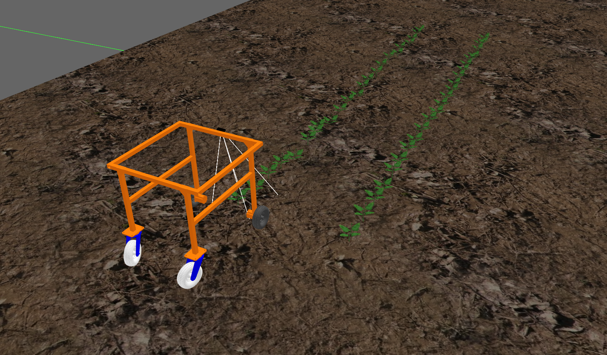
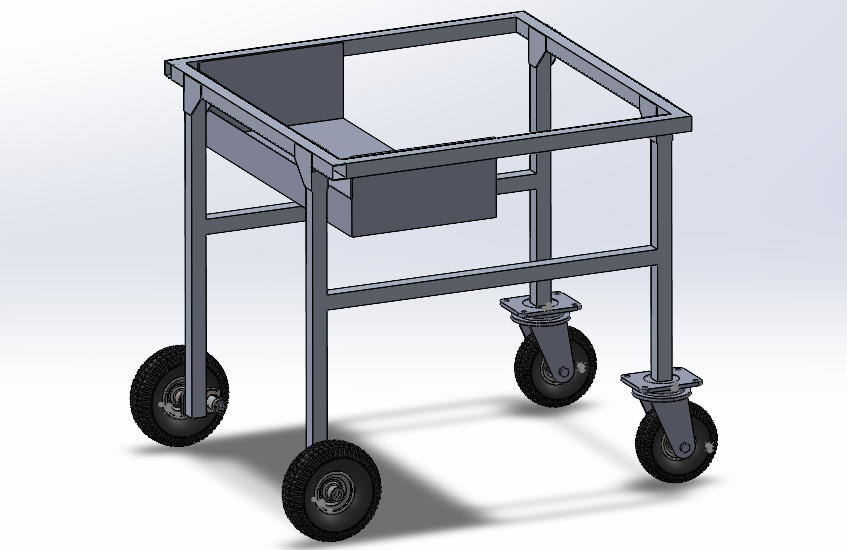
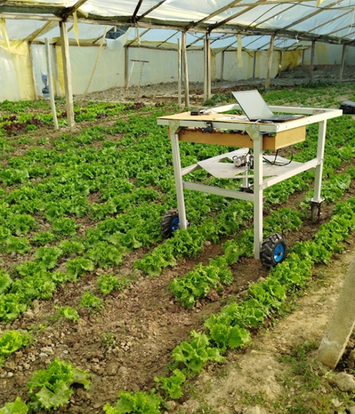

# 🌱 AI-Powered Weeding Robot

A prototype agricultural robot that autonomously identifies and eliminates weeds using AI vision, a delta robot, and a laser system — developed with ROS2 and trained with YOLOv8.

---

## 🧠 Features

- 🚜 Differential drive robot for autonomous navigation.
- 🌿 Weed vs. crop detection with YOLOv8 (90% accuracy).
- 🤖 Delta robot for precise movement.
- 🔥 Laser elimination system.
- 🧠 Built and tested in simulation and prototype.

---

## 🎥 Demo Video

*Demo video coming soon!*

---

## 🖼️ Images

<p align="center">
  
  
  
</p>


 
---

## 🔧 Technologies Used

- **ROS2 Humble** – Robot Operating System.
- **YOLOv8** – Real-time object detection.
- **OpenCV** – Image processing.
- **Gazebo** – Simulation.
- **Python & C++** – For nodes and scripts.
- **SolidWorks** – For mechanical design.

---

## 🚀 How to Run

### 1. Clone the repository and build the workspace
```bash
# Create the workspace and source directory
mkdir -p ~/weeding_robot/src
cd ~/weeding_robot/src

# Clone the repository into the src folder
git clone https://github.com/BrandonAllan/Weeding_robot.git .

# Go back to the workspace root
cd ..

# Build the workspace
colcon build --symlink-install

# Source the workspace
source install/setup.bash
```

# Follow Folder Structure:
```
Weeding_robot
├── build
├── install
├── log
└── src
    ├── agri_robot_description
    |   ├── launch
    |   ├── meshes
    |   ├── urdf
    |   └── worlds
    ├── delta_robot
    |   ├── config
    |   ├── launch
    |   └── src          
    ├── diffdrive_robot_hardware
    ├── robot_joystick
    |   ├── config
    |   └── launch
    ├── robot_navigation
    |   ├── config
    |   ├── launch
    |   └── robot_navigation
    ├── serial
    └── weeding_robot
        ├── config
        └── launch
```
---
## Navigation

<p align="center">
  
  
</p>

## 🧠 Contact
For inquiries, feedback, or collaboration opportunities, please don't hesitate to reach out to me, Brandon Trujillo. As the maintainer of the project, I'm always open to discussions and potential partnerships. (allanbrandon34@gmail.com)

