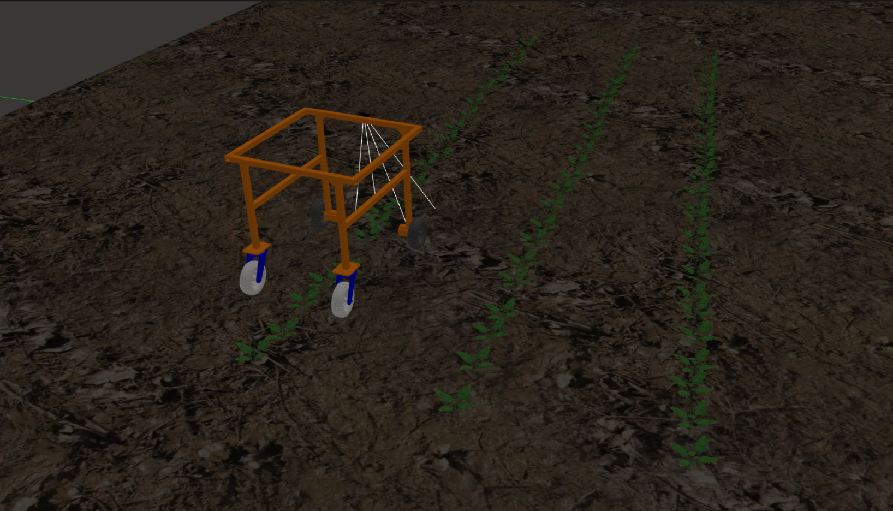

# 🌱 AI-Powered Weeding Robot

A prototype agricultural robot that autonomously identifies and eliminates weeds using AI vision, a delta robot, and a laser system — developed with ROS2 and trained with YOLOv8.

---

## 🧠 Features

- 🚜 Differential drive robot for autonomous navigation.
- 🌿 Weed vs. crop detection with YOLOv8 (90% accuracy).
- 🤖 Delta robot for precise movement.
- 🔥 Laser elimination system.
- 🧠 Built and tested in simulation and prototype.

---

## 🎥 Demo Video


---

## 🖼️ Images

 

 
---

## 🔧 Technologies Used

- **YOLOv8** – Real-time object detection.
- **ROS2 Foxy** – Robot Operating System middleware.
- **OpenCV** – Image processing.
- **Gazebo** – Simulation.
- **Python & C++** – For nodes and scripts.
- **Fusion 360 / SolidWorks** – For mechanical design.
- **Custom PCB** – For robot control.

---

## 🚀 How to Run

### 1. Clone the repository
  - follow this steps:
  ```
    mkdir -p ~/weeding_robot/src
    colcon build --symlink-install
    cd src
    git clone https://github.com/BrandonAllan/Weeding_robot.git .
  ```

# Follow Folder Structure:
```
Weeding_robot
├── build
├── install
├── log
└── src
    ├── agri_robot_description
    |   ├── launch
    |   ├── meshes
    |   ├── urdf
    |   └── worlds          
    ├── diffdrive_robot_hardware
    ├── robot_joystick
    ├── robot_navigation
    ├── serial
    └── weeding_robot
```

## 🧠 Contact
For inquiries, feedback, or collaboration opportunities, please don't hesitate to reach out to me, Brandon Trujillo. As the maintainer of the project, I'm always open to discussions and potential partnerships. (allanbrandon34@gmail.com)